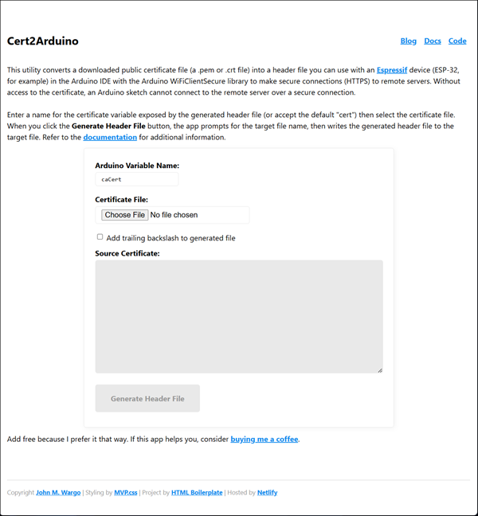

# Certificate to Arduino Header File Converter

Public site: https://cert2arduino.netlify.app/

## Tasks

- [ ] Take screenshot
- [ ] Update readme
- [ ] Add Google Analytics
- [ ] Write wiki page
- [ ] Make repo public
- [ ]
- [ ]
- [ ]

## About

Coded the app in WebStorm using the HTML Boilerplate template
Styling by MVP.css
Hosting by Netlify

## Using

