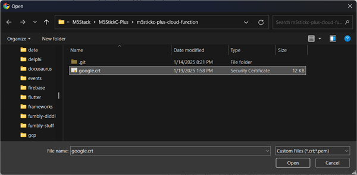
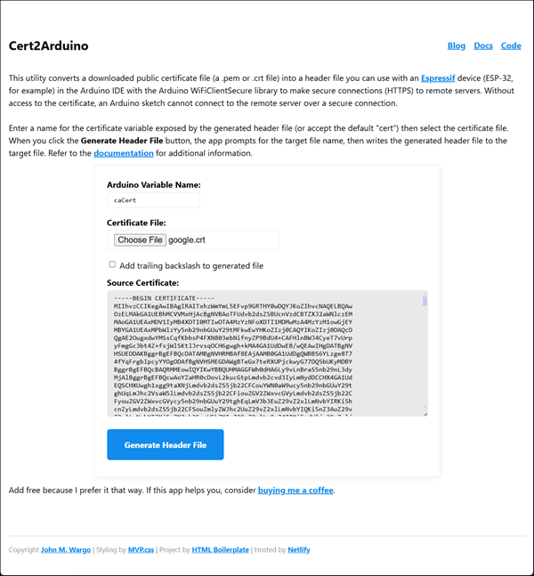

# Certificate to Arduino Header Converter

[](https://app.netlify.com/sites/cert2arduino/deploys)

A simple web application that allows visitors to convert a downloaded certificate file (a `.pem` or `.crt` file) into a header file you can use with an [Espressif](https://www.espressif.com/) device (ESP-32, for example) in the Arduino IDE with the Arduino `WiFiClientSecure` library to make secure connections (HTTPS) to remote servers. Without access to the certificate, an Arduino sketch cannot connect to the remote server over a secure connection.

## Open Tasks

- [x] Update readme
- [ ] Write wiki page
- [ ] App icon
- [ ] Validate that the input variable name is valid in C.
- [ ]

## Background

While working on an ESP32 project, I realized that I needed a way to make a secure (SSL) connection to a web server to retrieve some data. In the example code included with the Arduino IDE as well as some online tutorials, I realized that I need to download the certificate for the server, then convert it into a format that an Arduino sketch could use to make secure connections to the server.

Basically, the download certificate is a text file with a specific format:

```text
-----BEGIN CERTIFICATE-----
MIIhvzCCIKegAwIBAgIRAITxhzWmYmL5EFvp9GRTHY0wDQYJKoZIhvcNAQELBQAw
OzELMAkGA1UEBhMCVVMxHjAcBgNVBAoTFUdvb2dsZSBUcnVzdCBTZXJ2aWNlczEM
MAoGA1UEAxMDV1IyMB4XDTI0MTIwOTA4MzYzNFoXDTI1MDMwMzA4MzYzM1owGjEY
.
.
.
mcNL3qT7c96/YJZvxPiXDCfAvaKv3zYq+vH1O4hpJ1XYm7SFeHFQ5AyisnKP4z7U
uDcTXhOPTOtzsVMEaRbCaYwq+y/4AxLasMtUj4h20s9E2BwMgSy8jjbvlTZKli4D
hSaI
-----END CERTIFICATE-----
```

The file contains a header (`-----BEGIN CERTIFICATE-----`) and footer (`-----END CERTIFICATE-----`) that delimits the certificate code. Everything in between is the raw code of the public certificate.

**Note:** That particular file is 184 lines long, so I used the three periods vertically  in the middle to indicate that part of the file was cut out of the example.

To use that certificate in an Arduino sketch,  you must first convert it into a format that the Arduino IDE understands. Specifically you must convert it to a file that:

1. Defines a variable name for the certificate. You'll reference this name in the code that leverages the certificate. In the example code below, this is the `const char* cert=` code that creates a variable called `cert` for the certificate.
2. Adds a continuation character (`\`) at the end of every line (except the last one) telling the Arduino compiler that there are more lines in the current statement.
3. Quotation marks (`"`) at the beginning and end of each line (before the continuation character).
4. A newline (`\n`) at the end of each line before the ending quotation mark.

Here's what the modified file looks like (with the same indicator showing that I dropped a bunch of lines from the output):

```c
const char* cert= \
"-----BEGIN CERTIFICATE-----\n" \
"MIIhvzCCIKegAwIBAgIRAITxhzWmYmL5EFvp9GRTHY0wDQYJKoZIhvcNAQELBQAw\n" \
"OzELMAkGA1UEBhMCVVMxHjAcBgNVBAoTFUdvb2dsZSBUcnVzdCBTZXJ2aWNlczEM\n" \
"MAoGA1UEAxMDV1IyMB4XDTI0MTIwOTA4MzYzNFoXDTI1MDMwMzA4MzYzM1owGjEY\n" \
.
.
.
"mcNL3qT7c96/YJZvxPiXDCfAvaKv3zYq+vH1O4hpJ1XYm7SFeHFQ5AyisnKP4z7U\n" \
"uDcTXhOPTOtzsVMEaRbCaYwq+y/4AxLasMtUj4h20s9E2BwMgSy8jjbvlTZKli4D\n" \
"hSaI\n" \
"-----END CERTIFICATE-----\n";
```

Making those changes to the certificate file isn't impossible, but at 184 lines for this particular example, it's pretty tedious work If you have to do this frequently for certificates for different sites. Since I don't like doing that type of tedious work, I decided to build a utility that handles the process for me (and you).

That's why you're here.


## Operation

To use the utility, you must download a server's public key into a `.pem` or `.crt` file. I'm not going to show you how to do that here, just follow the instructions found online. Here's a good example: [How to Download the SSL Certificate From a Website in Windows](https://www.instructables.com/How-to-Download-the-SSL-Certificate-From-a-Website/).

With the file in-hand, navigate to the utility at [Cert2Arduino](https://cert2arduino.netlify.app/). You'll see an interface similar to the following:


Enter a name for the certificate variable exposed by the generated header file (or accept the default "cert"). In this example, and the example generated file shown above, I used `cert`. You can use anything that you want here as long as it is a valid C variable name.

> A valid C variable name can contain letters, digits, and underscores, but must always start with a letter or an underscore; it cannot start with a number, contain spaces, or use reserved keywords like "int" or "float" - examples include: "age", "my_variable", "totalSum", "x", "y".

Reference: [C Variable Names (Identifiers)](https://www.w3schools.com/c/c_variables_names.php).

Next, click the **Chose File** button and navigate to the folder location where you stored the public certificate file. Select the file then click the **Open** button as shown in the example below. If you're on macOS or Linux, this may look a little different but the process is generally the same.



The app UI will update to show the contents of the selected certificate file.



Click the <strong>Generate Header File</strong> button and the app will prompt you to select the target folder and file name for the generated header file to the target file.

To use the header file in your Arduino sketch, add the following line to the top of the sketch's main file:

```c
#include "cert.h"
```

That's it, reference the file's variable name in your code like this:

```c
client.setCACert(cert);
```


## About

I built this application using the [JetBrains WebStorm](https://www.jetbrains.com/webstorm/) IDE and the [HTML5 Boilerplate](https://html5boilerplate.com/) template. I licensed the IDE for many years, but never used it for much. I wanted to play with HTM5 Boilerplate, so this app gave me a chance to do so.

I used [MVP.css](https://github.com/andybrewer/mvp) to style the application; it provides a very simple and clean UX for the app. The stylesheet uses huge padding at the top and the bottom of the page, so I had to tune that down a little to give the app the look I wanted.

Since this is an open source project, I'm able to host the app for free on [Netlify](https://www.netlify.com/); thanks Netlify!

---

If this code helps you, please consider buying me a coffee.

<a href="https://www.buymeacoffee.com/johnwargo" target="_blank"></a>

